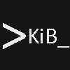

# The KIB in Batch project

*Run Unix tools on Windows easily*

Welcome to the homepage of the KIB in Batch project. This mainly contains documentation in other pages, but here you can see short info about the project.

## Why use KIB in Batch

KIB in Batch is a lightweight Unix-like environment for Microsoft Windows.

### Enterprise Ready

* A minimal installation (without Nmap and Neovim) weighs only around 1 megabyte.
* The project runs on any Windows version that is Windows 10 or newer (system must have cURL in PATH).
* The project contains lots of features and an LTS version.

### Easy command-line shell

* Unix commands are easy to learn. They are all abbreviations, so for example to list files, you can use `ls`. For the list of the Unix commands, type `busybox`.

### Productivity

* Use Neovim to configure, take notes, write documents, etc.
* Use ping to test that your network is working.
* Use curl to download files from the internet.
* KIB in Batch uninstaller handles back ups of your home directory when you uninstall, so if you reinstall you will be able to seamlessly continue your work.

### Easy installation

* Download the [latest version](https://github.com/KIB-in-Batch/KIB-in-Batch/releases/latest) from GitHub. Specifically download kib_in_batch.zip.
* Run kib_in_batch.bat.
* Quickly get KIB in Batch running.
* On the non-LTS version, deploy containers using KIBDock.

### Use cases

* IoT devices: KIB in Batch is a great tool for IoT devices. It is lightweight and, on IoT devices, it easily beats Cygwin, Msys and WSL.
* As a shell to run when SSHing to a Windows server: Usually, you would not want to use CMD or PowerShell for a server. This is where KIB in Batch comes in, you run KIB in Batch on the server and you can use Unix commands while managing the Windows server.

## Features

* KIBDock for creating and deploying containers.
* Package manager (KIB-pkg) for installing and uninstalling packages.
* BusyBox for a lightweight suite of Unix utilities.
* Nmap (can be skipped if you use manual install).
* Neovim (can be skipped if you use manual install).
